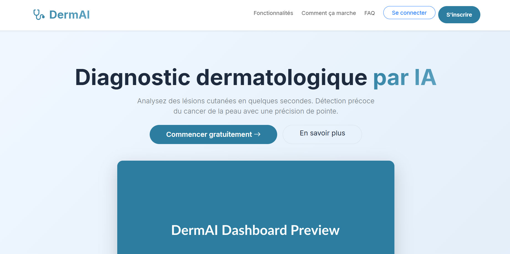
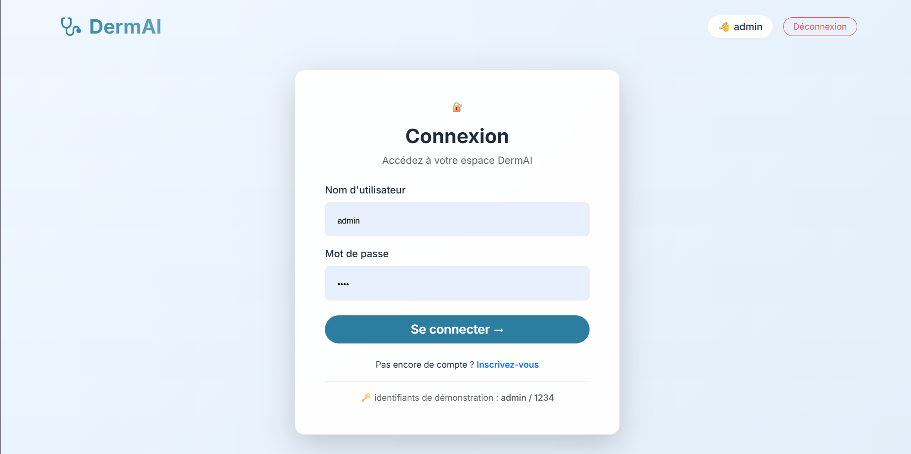
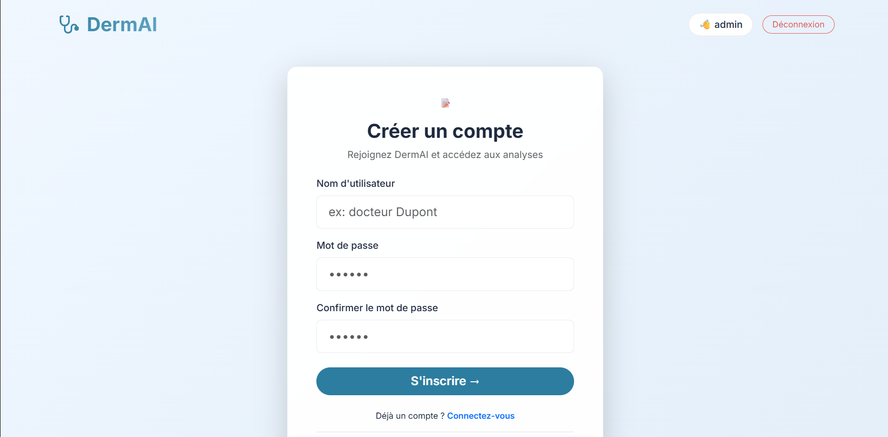
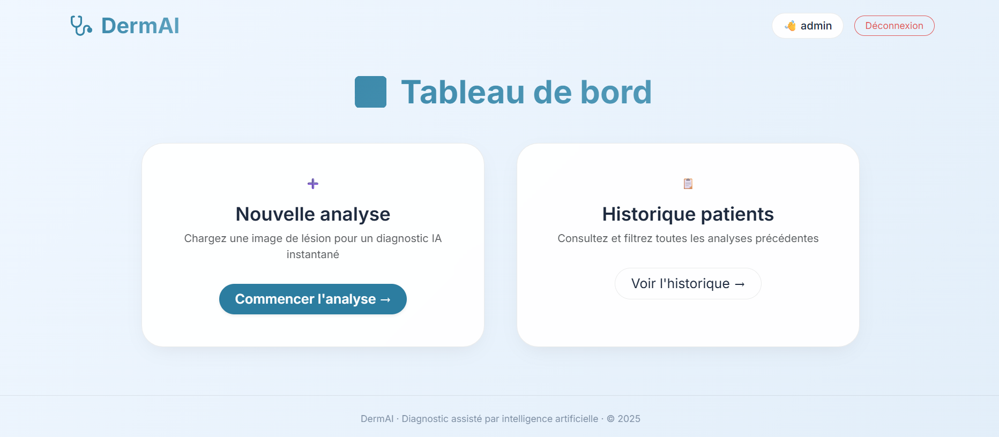
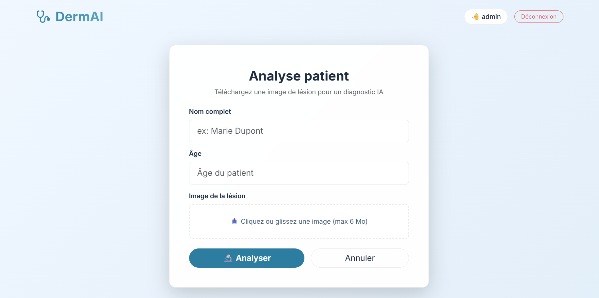
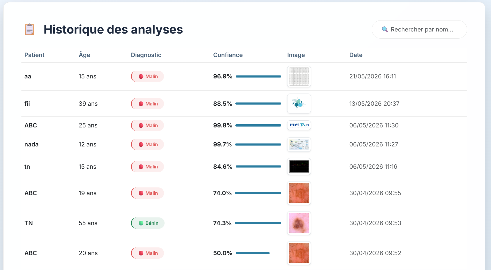

#  DermAI — AI-Assisted Skin Cancer Detection

[](https://www.python.org/)
[](https://flask.palletsprojects.com/)
[](https://tensorflow.org/)
[](LICENSE)

> **DermAI** is a lightweight, web-based diagnostic assistant that uses a deep-learning model (VGG16) to classify skin lesions as **benign** or **malignant** from dermoscopic images. Built for healthcare professionals and educational purposes, it provides instant predictions with confidence scores and keeps a full patient history.

---

##  Screenshots

| Page | Preview |
|------|---------|
| **Home / Landing** |  |
| **Login** |  |
| **Register** |  |
| **Dashboard** |  |
| **New Analysis** |  |
| **Patient History** |  |

---

##  Features

-  **AI-Powered Analysis** — VGG16 CNN trained on thousands of annotated skin-lesion images  
-  **Image Upload** — Drag-and-drop or click-to-upload with live preview (JPEG/PNG, max 6 MB)  
-  **Dashboard** — Clean overview to start a new analysis or browse history  
-  **Patient History** — Searchable table of past diagnoses with confidence bars and thumbnails  
-  **Authentication** — Secure login / registration system with form validation  
-  **Responsive UI** — Fully mobile-friendly, light-themed glass-morphism interface  
-  **Real-time Feedback** — Animated confidence progress bars and flash notifications  
-  **MySQL Database** — Persistent storage for users and patient records  

---

## 🛠 Tech Stack

| Layer | Technology |
|-------|------------|
| Backend | Python, Flask 2.3 |
| ML / AI | TensorFlow 2.13, Keras, NumPy |
| Database | MySQL (via `mysql-connector-python`) |
| Frontend | HTML5, Bootstrap 5.3, Vanilla JS, CSS3 |
| Fonts | Inter (Google Fonts) |

---

## Quick Start

### 1. Clone the repository

```bash
git clone https://github.com/yourusername/dermai.git
cd dermai
```

### 2. Create a virtual environment

```bash
python -m venv venv

# Windows
venv\Scripts\activate

# macOS / Linux
source venv/bin/activate
```

### 3. Install dependencies

```bash
pip install -r req.txt
```

### 4. Set up the database

1. Make sure MySQL is running (default port `3307` or update `app.py`).
2. Import the provided schema:

```bash
mysql -u root -p < database.sql
```

> The schema creates the `skin_cancer_db` database, `users` and `patients` tables, and inserts a default admin account.

### 5. Add the VGG16 model

Place your trained Keras model file inside a `model/` directory:

```
dermai/
├── model/
│   └── vgg16_skin_cancer.h5   <-- your model here
├── static/
├── templates/
└── app.py
```

> If you don't have a model yet, the app will raise an error on startup. You can train one on the [HAM10000](https://dataverse.harvard.edu/dataset.xhtml?persistentId=doi:10.7910/DVN/DB86F2) or [ISIC Archive](https://challenge.isic-archive.com/) datasets, or adapt the code to run in **demo mode**.

### 6. Run the application

```bash
python app.py
```

Open your browser at: **http://127.0.0.1:5000**

---

## Demo Credentials

| Username | Password |
|----------|----------|
| `admin`  | `1234`   |

Use these to log in and explore the dashboard immediately after setup.

---

## Project Structure

```
dermai/
├── app.py                 # Flask application (routes, logic, DB connection)
├── database.sql           # MySQL schema + seed data
├── req.txt                # Python dependencies
├── model/
│   └── vgg16_skin_cancer.h5
├── static/
│   ├── style.css          # Custom CSS (glass-morphism, variables, animations)
│   ├── main.js            # Frontend logic (upload, preview, search, loading)
│   └── uploads/           # Uploaded lesion images (auto-created)
├── templates/
│   ├── base.html          # Master layout (navbar, flashes, footer)
│   ├── home.html          # Public landing page (marketing / info)
│   ├── login.html         # Login form
│   ├── register.html      # Registration form with client-side validation
│   ├── dashboard.html     # Main dashboard (new analysis + history)
│   ├── predict.html       # Image upload & patient info form
│   ├── result.html        # Diagnosis result with confidence bar
│   └── patients.html      # Searchable history table
└── screenshots/           # 📸 UI screenshots for README (see below)
    ├── home.png
    ├── login.png
    ├── register.png
    ├── main.png
    ├── analyse.png
    └── history.png
```

---

## How to Add the Screenshots

To make the images display correctly in your README, follow these steps:

### Option A: Store images in the repository (recommended)

1. **Create a `screenshots/` folder** in your project root:
   ```bash
   mkdir screenshots
   ```

2. **Copy your image files** into that folder with these exact names:
   - `home.png` — Landing page
   - `login.png` — Login form
   - `register.png` — Registration form
   - `main.png` — Dashboard
   - `analyse.png` — New analysis / upload form
   - `history.png` — Patient history table

3. **Commit and push** to GitHub:
   ```bash
   git add screenshots/
   git commit -m "Add UI screenshots to README"
   git push origin main
   ```

> The README uses relative paths (`screenshots/home.png`), so GitHub will render them automatically once pushed.

### Option B: Use GitHub's image hosting (drag & drop)

1. Open your repository on GitHub.
2. Navigate to **Issues → New Issue** (you don't need to submit it).
3. Drag and drop each image into the issue comment box.
4. GitHub will upload the image and give you a direct URL like:
   ```
   https://user-images.githubusercontent.com/12345678/xxxxxxxxx/home.png
   ```
5. Copy those URLs and replace the relative paths in the README with the full URLs.

### Option C: Use an external image host

Upload the images to any image hosting service (Imgur, Cloudinary, etc.) and replace the paths in the README with the direct image URLs.

---

## Usage Flow

1. **Landing Page** (`/`) — Public page presenting the product, features, FAQ, and contact info.  
2. **Login / Register** (`/login`, `/register`) — Create an account or sign in.  
3. **Dashboard** (`/dashboard`) — Choose between a new analysis or viewing history.  
4. **Predict** (`/predict`) — Enter patient name & age, upload a lesion image, and submit.  
5. **Result** (`/result`) — View the AI diagnosis (**Bénin** or **Malin**) with an animated confidence score.  
6. **Patients** (`/patients`) — Browse, search, and review all previous analyses.

---

## Medical Disclaimer

**DermAI is an educational and research tool.** It is **not** a certified medical device and must **not** be used as a substitute for professional dermatological diagnosis. Always consult a qualified healthcare provider for medical advice.

---

## Environment Variables (Optional)

For production, consider extracting sensitive values into environment variables:

```bash
export FLASK_SECRET_KEY="your-secret-key"
export DB_HOST="localhost"
export DB_PORT="3307"
export DB_USER="root"
export DB_PASSWORD="yourpassword"
export DB_NAME="skin_cancer_db"
```

Then update `app.py` to read from `os.environ` instead of hard-coded strings.

---

## Contributing

Contributions are welcome! Feel free to open issues or submit pull requests for:

- Additional model architectures (ResNet, EfficientNet, etc.)
- Docker support
- REST API endpoints
- Multi-language support
- Enhanced image preprocessing (data augmentation, segmentation)

---

## Acknowledgements

- [TensorFlow](https://tensorflow.org/) & [Keras](https://keras.io/) for the deep-learning framework  
- [Bootstrap](https://getbootstrap.com/) for the responsive UI components  
- [Inter](https://rsms.me/inter/) font family by Rasmus Andersson  
- Skin-lesion datasets: [HAM10000](https://dataverse.harvard.edu/dataset.xhtml?persistentId=doi:10.7910/DVN/DB86F2), [ISIC Archive](https://challenge.isic-archive.com/)

---

<p align="center">
  <b>Made with love for better healthcare diagnostics.</b><br>
  <i>© 2025 DermAI</i>
</p>
